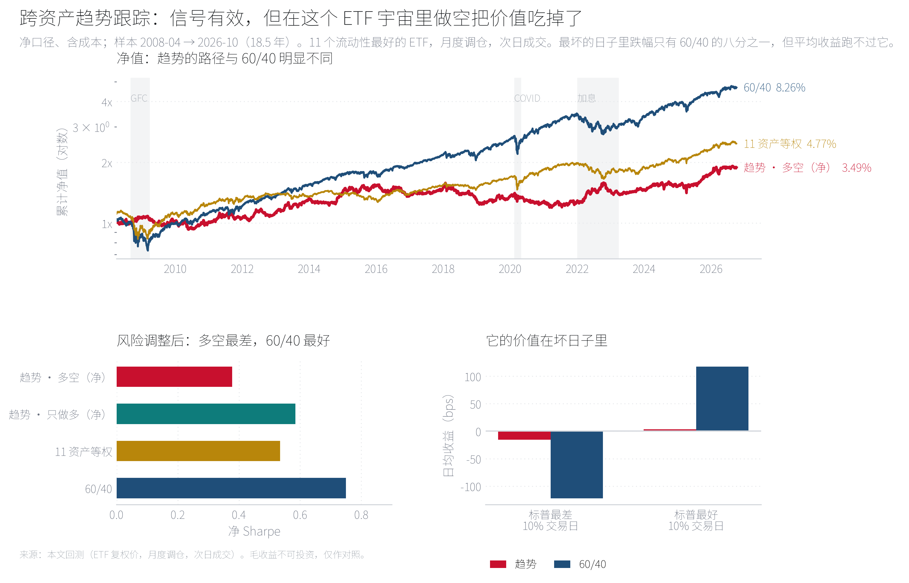

# Cross-asset trend following — a research implementation

跨资产时序动量（time-series momentum / trend following）的研究实现：数据、信号、组合构建、
成本、回测、归因、稳健性、容量，全部可复现；结论用机构研究部的 chart pack 形式呈现。

**Chart pack（已发布）**：<https://aayloo.github.io/cross-asset-trend/>
　·　源码：[`index.html`](index.html)



## 结论（先说结果）

| 组合 | 年化 | 波动 | Sharpe | 最大回撤 | 两向换手/年 |
|---|---|---|---|---|---|
| 趋势 · 多空（目标波动 10%） | 3.49% | 9.24% | 0.38 | −24.5% | 3.65× |
| 趋势 · 只做多 | 6.15% | 10.54% | **0.58** | −23.6% | 2.78× |
| 60/40 | 8.26% | 11.01% | **0.75** | −32.2% | 0.12× |
| 11 资产等权 | 4.77% | 8.92% | 0.53 | −27.8% | 0.18× |

样本 2007-03 → 2026-10（策略自 2008-04 起，信号需 252 日预热），净口径、含成本。

四条结论：

1. **信号有效但很薄**：`sign(12 个月动量)` 对未来 21 日方向的命中率约 **53%**，
   30 组参数（6 个回看窗口 × 5 个目标波动率）**全部为正**——不是单点拟合。
2. **做空是这个宇宙的问题**：11 个长牛 ETF 上，1/N 多空毛 Sharpe 只有 0.15，
   只做多是 0.56。趋势需要「会跌的资产」，而这批 ETF 里几乎没有。
3. **它的价值在条件收益**：标普最差 10% 的交易日里，趋势日均 −15.4 bps，
   60/40 是 −122.1 bps；2022 年趋势 +13.9%、60/40 −16.6%。**它是保险，不是发动机。**
4. **容量卡在工具上**：ETF 形式的容量约 **0.5 百万美元**（约束来自日元 ETF），
   真实实施必须走期货——这直接给出 v2 的规格。

完整论证： [`reports/research_note.md`](reports/research_note.md)

## 一条命令复现

```bash
python run.py --config config/base.yml --out reports   # 数据 → 信号 → 回测 → 10 张图 → chart pack
python -m pytest -q                                    # 9 个不变量测试（无需联网）
python tools/diagnose.py                               # 信号诊断：命中率、1/N 对拍、符号自检
node tools/check_chartpack.js                          # chart pack 的图片与窄屏体检
```

第一次运行会从 Yahoo Finance 抓取 11 个 ETF 的日频复权价并缓存到 `data/`；之后不再联网。

```
config/            全部参数（资产池、信号、组合、成本、稳健性扫描），代码里不写死数字
src/catrend/       引擎：config / data / signals / portfolio / backtest / evaluation / figures / chartpack
notebooks/         只读结果的研究笔记（不产出任何结论数字）
tests/             未来函数、成本恒等式、权重约束、快慢实现对拍
reports/           图表（SVG+PNG）、结果表、research_note、manifest
tools/             诊断与网页体检
```

## 方法（每一步都可单独检验）

| 项 | 设定 |
|---|---|
| 资产池 | SPY、EFA、EEM、IEF、TLT、GLD、DBC、UUP、FXE、FXY、VNQ |
| 信号 | 过去 252 个交易日的累计收益取符号 |
| 仓位 | 方向 × 1/波动，再用 60 日协方差把事前波动校准到 10%；单资产 ≤35%，总敞口 ≤2.0 |
| 调仓 | 月度（月末最后一个交易日生成信号），**次日收盘成交** |
| 成本 | 按资产类别单向 2–5 bps（股票/利率 2、黄金 3、外汇 3、REIT 4、商品 5） |
| 无未来函数 | 信号只用截至当日收盘的数据；次日成交，再下一日才承担收益；`tests/test_core.py` 用力导数据证明 |

**必须写在前面披露的口径问题**：

1. **ETF 不能做空**，多空账簿假设通过期货/互换实现，因此没有借券成本与保证金约束。
2. **ETF 复权价不含 roll**：优点是收益干净，代价是看不到 carry。
3. **样本从 2007 年开始**，覆盖 QE 全程——这是趋势策略公认的弱周期。
4. 参数扫描 30 组，未做正式的多重检验调整。

## 可视化

`reports/exhibits/` 有 10 张图，按机构 chart pack 规格制作：一句话结论式标题、
事件区间底色、曲线端点直接标注、Exhibit 编号、左下角固定来源行。
所有图在生成时跑**文字重叠自检**（包围盒两两求交），生成日志里可以看到
`✓ ex2-nav: 无文字重叠` 这样的检查结果——看不到渲染结果时，这是替代肉眼的方式。

## 发布为网页（GitHub Pages）

仓库设置 → Pages → Source 选 `Deploy from a branch` → `main` / `(root)`，保存即可。
chart pack 位于仓库根目录的 `index.html`，发布后地址是
`https://<user>.github.io/cross-asset-trend/`。

## 路线图

- **v2（下一步）**：换成连续期货——ES/NQ、ZN/ZB、GC/SI/HG、CL/NG、ZC、6E/6J/6B/6A，
  2001 年起约 25 年，加入真实合约乘数与保证金，披露 roll 影响，用 ETF 层做对照，
  直接检验「做空需要会跌的资产」这个假设。
- **v3**：加入 carry / value 信号做正交比较，判断这里赚的到底是不是趋势的钱。
- **v4**：用真实成交额重做容量与市场冲击，给出可承载规模的区间估计。

## 环境

Python 3.11+（本机 3.13 与 3.9 均可跑），依赖见 `pyproject.toml`。

## 免责声明

研究记录，不构成投资建议。数据来自公开来源，历史表现不代表未来收益。
MIT License。
